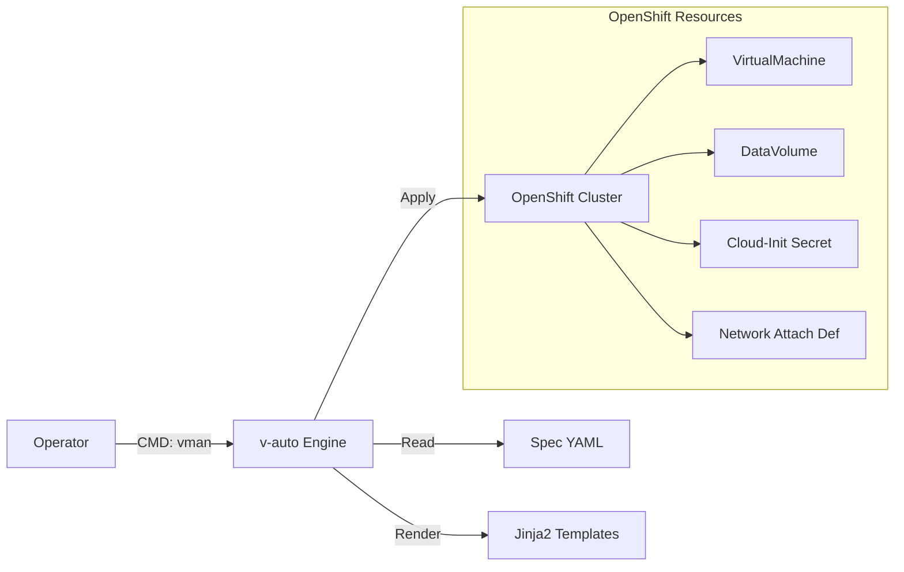

# 📘 v-auto 통합 운영 가이드 (Master Manual)
**Version**: 1.0 (2026.01)
**Target**: Technical Support Team / Operator

---

## 📚 목차 (Table of Contents)
1.  **소개 및 아키텍처 (Introduction)**
    *   툴의 목적 및 구조
    *   작업 디렉토리 안내
2.  **스펙 작성 가이드 (Spec Reference)**
    *   `infrastructure` (네트워크/이미지)
    *   `common` (기본 설정)
    *   `cloud_init` (계정 및 보안)
    *   `instances` (VM 상세 정의)
3.  **운영 절차 (Operation SOP)**
    *   Step 1: 검증 (`inspect`)
    *   Step 2: 배포 (`deploy`)
    *   Step 3: 확인 (`status`)
    *   Step 4: 회수 (`delete`)
4.  **상세 동작 원리 (Deep Dive)**
    *   데이터 매핑 및 템플릿 처리 과정
5.  **문제 해결 (Troubleshooting)**

---

## 1. 소개 및 아키텍처 (Introduction)

### 1.1 툴 개요
`v-auto`는 OpenShift Virtualization 기반의 VM 배포를 **단일 YAML 스펙**으로 자동화하는 도구입니다. 복잡한 K8s 리소스(VirtualMachine, DataVolume, Secret, NAD)를 직접 작성하지 않고, 직관적인 설정 파일 하나로 통합 관리합니다.

### 1.2 시스템 구조


### 1.3 작업 디렉토리 구조 (`/home/core/v-auto`)
*   **`vman`**: 실행 스크립트 (모든 명령의 진입점)
*   **`projects/`**: 프로젝트별 스펙 파일 저장소
    *   `opasnet/web.yaml`: (예시) Opasnet 프로젝트의 Web 서비스 스펙
*   **`templates/`**: 리소스 생성용 Jinja2 템플릿 (수정 금지)
    *   `vm_template.yaml`, `secret_template.yaml` 등

---

## 2. 스펙 작성 가이드 (Spec Reference)

**기준 파일**: `projects/opasnet/web.yaml`
모든 배포는 이 YAML 파일을 작성하는 것에서 시작합니다. 각 섹션별 작성법을 상세히 설명합니다.

### [A] Infrastructure (인프라 정의)
VM이 사용할 네트워크와 OS 이미지를 정의합니다.

**1. 네트워크 및 이미지 정의 (`infrastructure`)**
*   **YAML 입력 (`web.yaml`)**:
    ```yaml
    infrastructure:
      networks:
        default:
          bridge: br-virt          # (A) 물리 브리지 인터페이스
          nad_name: br-virt-net    # (B) OpenShift NAD 이름
      images:
        ubuntu-22.04:
          url: "http://.../ubuntu.qcow2" # (C) 이미지 소스
    ```
*   **검증 결과 (`vman inspect` Output)**:
    ```text
    [2] INFRASTRUCTURE CATALOG
          default   [MULTUS] NAD: br-virt-net   Bridge: br-virt
          ^ (A) 네트워크 ID       ^ (B) 생성될 NAD    ^ (C) 연결될 브리지 
    ```

### [B] Cloud-Init (계정 및 보안)
VM 시동 시 적용될 OS 설정을 정의합니다. 계정 생성, 패스워드 설정이 포함됩니다.

**1. 사용자 설정 (`cloud_init`)**
*   **YAML 입력 (`web.yaml`)**:
    ```yaml
    cloud_init: |
      chpasswd:
        list: |
          core:core       # ID:PW
          suser:suser
      users:
        - name: core      # (D) 관리자 계정
        - name: suser     # (E) 서비스 계정
    ```
*   **검증 결과 (`vman inspect` Output)**:
    ```text
    [4] CLOUD-INIT CONFIGURATION
          Users           :
            - core        <-- (D) 계정 확인
            - suser       <-- (E) 계정 확인
    ```

### [C] Instances (인스턴스 상세)
실제 배포할 VM들의 개별 설정을 정의합니다.

**1. VM 기본 설정 및 노드 고정**
*   **YAML 입력 (`web.yaml`)**:
    ```yaml
    instances:
      - name: web-01                    # (F) VM 이름
        cpu: "500m"                     # (G) CPU 자원
        node_selector:
          kubernetes.io/hostname: worker1 # (H) 노드 고정
    ```
*   **검증 결과 (`vman inspect` Output)**:
    ```text
    [3] INSTANCE & NETWORK CONFIGURATION
      [ INSTANCE: web-01 ]              <-- (F) 정의된 인스턴스
        Node Selector   : {'kubernetes.io/hostname': 'worker1'}  <-- (H) 스케줄링 확인
    ```

**2. 네트워크 및 고정 IP 설정**
각 인터페이스별로 IP를 지정합니다.
*   **YAML 입력 (`web.yaml`)**:
    ```yaml
    instances:
      - name: web-01
        interfaces:
          - network: default            # (I) 'A'에서 정의한 네트워크 사용
        network_config:
          ethernets:
            enp1s0:                     # (J) 인터페이스명 (순서대로)
              addresses: [10.215.100.101/24]   # (K) 고정 IP
    ```
*   **검증 결과 (`vman inspect` Output)**:
    ```text
        Interfaces      :
            - Name: nic0 | Network: default <-- (I) 네트워크 연결 확인
        IP Address      :
            - enp1s0 = 10.215.100.101/24    <-- (K) 설정된 고정 IP 확인
              (Cloud-Init Override)
    ```

**3. 다중 인스턴스 배포 및 검증 (Multi-Instance)**
*   **YAML 입력 (`web.yaml`)**:
    ```yaml
    instances:
      - name: web-01                    # VM 1 
        node_selector: {hostname: worker1}
      - name: web-02                    # VM 2
        node_selector: {hostname: worker2}
    ```
*   **검증 결과 (`vman status` Output)**:
    ```text
    NAME     STATUS    NODE      IP
    web-01   Running   worker1   10.215.100.101  <-- 개별 배포 확인
    web-02   Running   worker2   10.215.100.102
    ```

**4. 다중 네트워크 구성 (Multi-NIC)**
*   **YAML 입력 (`web.yaml` - web-02)**:
    ```yaml
    interfaces:
      - network: default   # nic0
      - network: storage   # nic1
    network_config:
      ethernets:
        enp1s0: {addresses: [10.215.100.102/24]}
        enp2s0: {addresses: [192.168.10.50/24]}
    ```
*   **검증 결과 (`vman inspect` Output)**:
    ```text
    [ INSTANCE: web-02 ]
        Interfaces      :
            - Name: nic0 | Network: default
            - Name: nic1 | Network: storage  <-- 두 번째 인터페이스
        IP Address      :
            - enp1s0 = 10.215.100.102/24
            - enp2s0 = 192.168.10.50/24      <-- 스토리지망 IP 확인
    ```

---

## 3. 운영 절차 (Operation SOP)

모든 명령은 `./vman [프로젝트] [스펙] [액션]` 형식을 따릅니다.

### Step 1: 설정 검증 (Inspect)
작성한 스펙이 정상적으로 해석되는지 확인합니다. **가장 먼저 수행해야 할 단계입니다.**

```bash
./vman opasnet web inspect
```
**[출력 예시]**:
```text
================================================================================
[ v-auto ] VM Specification Inspector
================================================================================
[1] PROJECT INFORMATION
      Project         : opasnet
      Service         : web
      Spec File       : /home/core/v-auto/projects/opasnet/web.yaml

[2] INFRASTRUCTURE CATALOG
      default   [MULTUS] NAD: br-virt-net   Bridge: br-virt
      storage   [MULTUS] NAD: br-storage-net   Bridge: br-storage

[3] INSTANCE & NETWORK CONFIGURATION
  [ INSTANCE: web-01 ]
    Resources       : CPU=500m, Memory=1Gi
    Node Selector   : {'kubernetes.io/hostname': 'worker1'}
    Interfaces      :
        - Name: nic0 | Network: default
    IP Address      :
        - enp1s0 = 10.215.100.101/24
          (Cloud-Init Override)

[4] CLOUD-INIT CONFIGURATION
      Users           :
        - core
        - suser
```
> **Check Point**: 네트워트(`[2]`), IP 주소(`[3]`), 사용자(`[4]`) 정보가 의도한 대로 표시되는지 확인하십시오.

### Step 2: 배포 (Deploy)
검증이 끝난 스펙을 실제 클러스터에 반영합니다.

**1. Dry-Run (모의 배포)**: 실제 반영 전 생성될 YAML을 미리 봅니다.
```bash
./vman opasnet web deploy --dry-run
```
**[출력 예시]**:
```text
[DRY-RUN] Generated Manifest for VirtualMachine: web-01
apiVersion: kubevirt.io/v1
kind: VirtualMachine
metadata:
  name: web-01
  namespace: vm-opasnet
...
(전체 매니페스트 출력)
```

**2. Apply (실제 배포)**:
```bash
./vman opasnet web deploy
```
**[출력 예시]**:
```text
[INFO] Applying configuration for web...
[INFO] Namespace 'vm-opasnet' exists.
[INFO] Secret 'web-01-cloud-init' created/configured.
[INFO] DataVolume 'web-01-root-disk' created/configured.
[INFO] VirtualMachine 'web-01' created/configured.
[SUCCESS] Deployment/Update completed for web.
```

### Step 3: 상태 확인 (Status)
배포 후 VM이 정상 동작하는지 모니터링합니다.

```bash
./vman opasnet web status
```
**[출력 예시]**:
```text
================================================================================
[ v-auto ] VM Service Status : opasnet / web
================================================================================
NAME     NAMESPACE     STATUS    READY   NODE       VMI-IP
web-01   vm-opasnet    Running   True    worker1    10.215.100.101

[ Active Runtime Info ]
  - web-01 : Phase=Running, IP=10.215.100.101, LaunchTime=2026-01-20T11:00:00Z

[ Recent Events ]
  No warning/error events found in namespace vm-opasnet.
```
> **Check Point**: `STATUS`가 `Running`이고 `VMI-IP`가 정상적으로 할당되었는지 확인하십시오.

### Step 4: 회수 (Delete)
작업이 종료되거나 잘못 배포된 경우 리소스를 일괄 삭제합니다.

```bash
./vman opasnet web delete
```
**[출력 예시]**:
```text
[WARN] You are about to DELETE the following resources for service 'web':
  - VirtualMachine: web-01
  - DataVolume: web-01-root-disk
  - Secret: web-01-cloud-init
  - Service: (If any)

Are you sure check? (y/n): y

[INFO] Deleting VirtualMachine web-01...
[INFO] Deleting DataVolume web-01-root-disk...
[INFO] Deleting Secret web-01-cloud-init...
[SUCCESS] All resources for 'web' have been deleted.
```

## 4. 상세 동작 원리 (Deep Dive)

**"내가 쓴 YAML이 어떻게 K8s 리소스가 되나요?"**

### 4.1 데이터 흐름 (Traceability)

| YAML Spec (`web.yaml`) | 처리 엔진 (`vm_manager.py`) | 템플릿 (`templates/`) | OpenShift Resource |
| :--- | :--- | :--- | :--- |
| `instances[].name` | `ctx['vm_name']` | `vm_template.yaml`<br>`{{ vm_name }}` | **VirtualMachine**<br>`metadata.name` |
| `instances[].cpu` | `ctx['cpu']` | `vm_template.yaml`<br>`{{ cpu }}` | **VirtualMachine**<br>`spec...requests.cpu` |
| `infrastructure.images` | `ctx['image_url']` | `datavolume_template.yaml`<br>`{{ image_url }}` | **DataVolume**<br>`spec.source.http.url` |
| `cloud_init` | `ctx['cloud_init']`<br>*(Base64 Encode)* | `secret_template.yaml`<br>`{{ userData }}` | **Secret**<br>`data.userData` |
| `network_config` | `ctx['network_config']` | `secret_template.yaml`<br>`{{ networkData }}` | **Secret**<br>`data.networkData` |

### 4.2 핵심 로직 설명
1.  **Inheritance (상속)**: `instances`의 설정은 `common` 설정을 덮어씁니다. (예: `web-01`이 `cpu`를 지정하면 `common.cpu`는 무시됨)
2.  **Jinja2 Templating**: 파이썬 엔진이 YAML 값을 읽어 템플릿의 `{{ variable }}` 위치에 문자열을 치환해 넣습니다.
3.  **Idempotency (멱등성)**: `apply` 명령을 사용하므로, 스펙이 변하지 않았다면 여러 번 실행해도 결과는 같습니다.

---

## 5. 문제 해결 (Troubleshooting)

A: `web.yaml`의 `network_config` 들여쓰기나 문법을 확인하세요. `ethernets` 키 바로 아래에 인터페이스명(`enp1s0`)이 와야 합니다.

**Q: `deploy` 중 권한 오류(Forbidden)가 발생합니다.**
A: `oc login -u admin`으로 로그인되어 있는지 확인하세요. (`oc whoami` 로 확인 가능)

**Q: VM은 Running인데 접속이 안 됩니다.**
A: `vman status`로 IP가 정상 할당되었는지 확인하고, `cloud-init` 로그를 확인해야 합니다. (콘솔 접속 필요)
