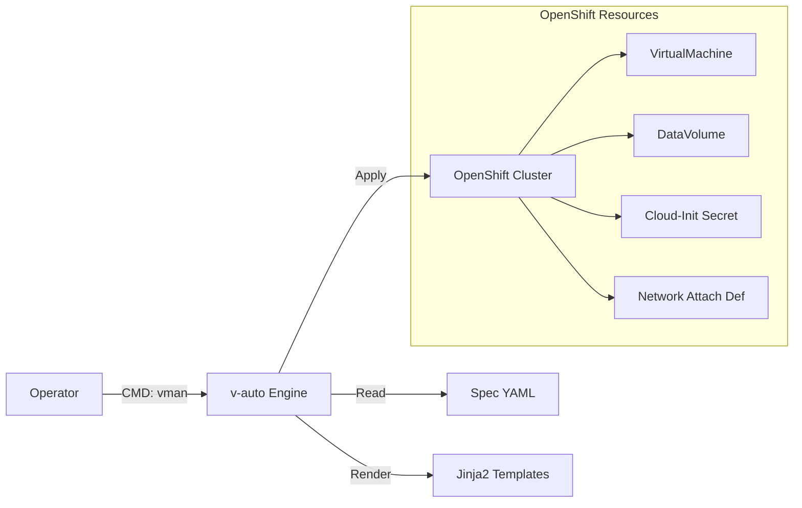

# 📘 v-auto 통합 운영 가이드 (Master Manual)
**Version**: 1.0 (2026.01)
**Target**: Technical Support Team / Operator

---

## 📚 목차 (Table of Contents)
1.  **소개 및 아키텍처 (Introduction)**
    *   툴의 목적 및 구조
    *   작업 디렉토리 안내
2.  **스펙 작성 가이드 (Spec Reference)**
    *   `infrastructure` (네트워크/이미지)
    *   `common` (기본 설정)
    *   `cloud_init` (계정 및 보안)
    *   `instances` (VM 상세 정의)
3.  **운영 절차 (Operation SOP)**
    *   Step 1: 검증 (`inspect`)
    *   Step 2: 배포 (`deploy`)
    *   Step 3: 확인 (`status`)
    *   Step 4: 회수 (`delete`)
4.  **상세 동작 원리 (Deep Dive)**
    *   데이터 매핑 및 템플릿 처리 과정
5.  **문제 해결 (Troubleshooting)**

---

## 1. 소개 및 아키텍처 (Introduction)

### 1.1 툴 개요
`v-auto`는 OpenShift Virtualization 기반의 VM 배포를 **단일 YAML 스펙**으로 자동화하는 도구입니다. 복잡한 K8s 리소스(VirtualMachine, DataVolume, Secret, NAD)를 직접 작성하지 않고, 직관적인 설정 파일 하나로 통합 관리합니다.

### 1.2 시스템 구조


### 1.3 작업 디렉토리 구조 (`/home/core/v-auto`)
*   **`vman`**: 실행 스크립트 (모든 명령의 진입점)
*   **`projects/`**: 프로젝트별 스펙 파일 저장소
    *   `opasnet/web.yaml`: (예시) Opasnet 프로젝트의 Web 서비스 스펙
*   **`templates/`**: 리소스 생성용 Jinja2 템플릿 (수정 금지)
    *   `vm_template.yaml`, `secret_template.yaml` 등

---

## 2. 스펙 작성 가이드 (Spec Reference)

**기준 파일**: `projects/opasnet/web.yaml`
모든 배포는 이 YAML 파일을 작성하는 것에서 시작합니다. 각 섹션별 작성법을 상세히 설명합니다.

### [A] Infrastructure (인프라 정의)
VM이 사용할 네트워크와 OS 이미지를 정의합니다.
```yaml
infrastructure:
  networks:
    default:
      bridge: br-virt          # 물리 브리지 인터페이스 (서버 구성에 따름)
      nad_name: br-virt-net    # OpenShift에 생성될 NAD 리소스 이름
    storage:
      bridge: br-storage
      nad_name: br-storage-net
      
  images:
    ubuntu-22.04:
      url: "http://10.215.1.240/.../ubuntu-22.04.qcow2" # 이미지 다운로드 경로
```

### [B] Cloud-Init (계정 및 스크립트)
VM 시동 시 적용될 OS 설정을 정의합니다. 계정 생성, 패스워드 설정, 초기 명령어가 포함됩니다.
```yaml
cloud_init: |
  #cloud-config
  chpasswd:
    list: |
      core:core       # ID:Password (운영 편의상 자동 설정)
    expire: False
  users:
    - name: core
      sudo: ALL=(ALL) NOPASSWD:ALL
      shell: /bin/bash
  runcmd:
    - [ systemctl, restart, ssh ] # 초기 실행 명령
```

### [C] Instances (인스턴스 상세)
실제 배포할 VM들의 개별 설정을 정의합니다. 가장 중요한 부분입니다.
```yaml
instances:
  - name: web-01                    # (1) VM 호스트명
    cpu: "500m"                     # (2) CPU 오버라이드 (기본값 무시)
    node_selector:
      kubernetes.io/hostname: worker1 # (3) 특정 노드 고정
      
    interfaces:                     # (4) 연결할 네트워크망 선택
      - network: default
      
    network_config:                 # (5) IP 및 라우팅 상세 (Netplan 문법)
      ethernets:
        enp1s0:
          addresses: [10.215.100.101/24]   # 고정 IP
          routes:
            - to: default
              via: 10.215.100.1            # 게이트웨이
```

---

## 3. 운영 절차 (Operation SOP)

모든 명령은 `./vman [프로젝트] [스펙] [액션]` 형식을 따릅니다.

### Step 1: 설정 검증 (Inspect)
작성한 스펙이 정상적으로 해석되는지 확인합니다. **가장 먼저 수행해야 할 단계입니다.**

```bash
./vman opasnet web inspect
```

**확인 포인트**:
1.  **IP Address**: `Auto/DHCP`가 아닌 `10.215.100.101/24` 처럼 고정 IP가 잘 파싱되는지 확인.
2.  **Infrastructure Catalog**: `NAD`와 `Bridge` 정보가 올바르게 매핑되었는지 확인.

### Step 2: 배포 (Deploy)
검증이 끝난 스펙을 실제 클러스터에 반영합니다.

```bash
./vman opasnet web deploy
```
*   **Dry-Run**: `--dry-run` 옵션을 추가하면 생성될 YAML을 미리 볼 수 있습니다.
*   **Password**: `web.yaml`에 비밀번호가 하드코딩 되어 있으므로 별도 입력 없이 진행됩니다.

### Step 3: 상태 확인 (Status)
배포 후 VM이 정상 동작하는지 모니터링합니다.

```bash
./vman opasnet web status
```
**출력 해석**:
*   **Virtual Machines**: `Ready: true`, `Status: Running` 이어야 합니다.
*   **Active Runtime**: `VMI-IP` 항목에 할당된 IP가 표시되는지 확인합니다.
*   **Recent Events**: `Warning`이나 `Error` 이벤트가 없는지 확인합니다.

### Step 4: 회수 (Delete)
작업이 종료되거나 잘못 배포된 경우 리소스를 일괄 삭제합니다.

```bash
./vman opasnet web delete
```
*   해당 스펙으로 생성된 `VM`, `Disk`, `Network`, `Secret`을 모두 찾아 목록을 보여준 뒤 삭제합니다.

---

## 4. 상세 동작 원리 (Deep Dive)

**"내가 쓴 YAML이 어떻게 K8s 리소스가 되나요?"**

### 4.1 데이터 흐름 (Traceability)

| YAML Spec (`web.yaml`) | 처리 엔진 (`vm_manager.py`) | 템플릿 (`templates/`) | OpenShift Resource |
| :--- | :--- | :--- | :--- |
| `instances[].name` | `ctx['vm_name']` | `vm_template.yaml`<br>`{{ vm_name }}` | **VirtualMachine**<br>`metadata.name` |
| `instances[].cpu` | `ctx['cpu']` | `vm_template.yaml`<br>`{{ cpu }}` | **VirtualMachine**<br>`spec...requests.cpu` |
| `infrastructure.images` | `ctx['image_url']` | `datavolume_template.yaml`<br>`{{ image_url }}` | **DataVolume**<br>`spec.source.http.url` |
| `cloud_init` | `ctx['cloud_init']`<br>*(Base64 Encode)* | `secret_template.yaml`<br>`{{ userData }}` | **Secret**<br>`data.userData` |
| `network_config` | `ctx['network_config']` | `secret_template.yaml`<br>`{{ networkData }}` | **Secret**<br>`data.networkData` |

### 4.2 핵심 로직 설명
1.  **Inheritance (상속)**: `instances`의 설정은 `common` 설정을 덮어씁니다. (예: `web-01`이 `cpu`를 지정하면 `common.cpu`는 무시됨)
2.  **Jinja2 Templating**: 파이썬 엔진이 YAML 값을 읽어 템플릿의 `{{ variable }}` 위치에 문자열을 치환해 넣습니다.
3.  **Idempotency (멱등성)**: `apply` 명령을 사용하므로, 스펙이 변하지 않았다면 여러 번 실행해도 결과는 같습니다.

---

## 5. 검증된 고급 시나리오 (Verified Scenarios)

다음은 실제 테스트 및 검증이 완료된 고급 구성 사례입니다.

### 5.1 다중 계정 설정 (Multiple Accounts)
하나의 VM에 여러 사용자를 생성하고 각각 비밀번호를 설정할 수 있습니다.
(`cloud_init` 항목을 통해 제어)
*   **예시**: 관리자(`core`)와 서비스 계정(`suser`) 동시 생성
*   **참고**: `chpasswd` 리스트에 `ID:Password` 형식으로 나열하면 자동으로 적용됩니다.

### 5.2 다중 네트워크 (Multiple Networks / Multi-NIC)
하나의 VM에 여러 개의 네트워크 인터페이스를 연결할 수 있습니다.
(`instances[].interfaces` 및 `network_config` 활용)
*   **예시**: `web-02` 인스턴스
    *   `nic0`: 서비스망 (`defaut` -> `br-virt`)
    *   `nic1`: 스토리지망 (`storage` -> `br-storage`)
*   **검증**: `vman status` 실행 시 IP가 두 개의 인터페이스(`enp1s0`, `enp2s0`)에 각각 할당된 것을 확인했습니다.

### 5.3 다중 인스턴스 배포 (Multiple Instances)
하나의 스펙 파일(`web.yaml`)로 서로 다른 설정을 가진 여러 VM을 동시에 배포할 수 있습니다.
*   **예시**:
    *   `web-01`: 0.5 vCPU, 단일망, Worker1 노드 고정
    *   `web-02`: 1.0 vCPU, 이중망, Worker2 노드 고정
*   **검증**: `deploy` 한 번으로 두 VM이 독립적인 설정(IP, Node, Resource)으로 생성됨을 확인했습니다.

---

## 6. 문제 해결 (Troubleshooting)

**Q: `vman inspect`에서 IP가 `Auto/DHCP`로 나옵니다.**
A: `web.yaml`의 `network_config` 들여쓰기나 문법을 확인하세요. `ethernets` 키 바로 아래에 인터페이스명(`enp1s0`)이 와야 합니다.

**Q: `deploy` 중 권한 오류(Forbidden)가 발생합니다.**
A: `oc login -u admin`으로 로그인되어 있는지 확인하세요. (`oc whoami` 로 확인 가능)

**Q: VM은 Running인데 접속이 안 됩니다.**
A: `vman status`로 IP가 정상 할당되었는지 확인하고, `cloud-init` 로그를 확인해야 합니다. (콘솔 접속 필요)
