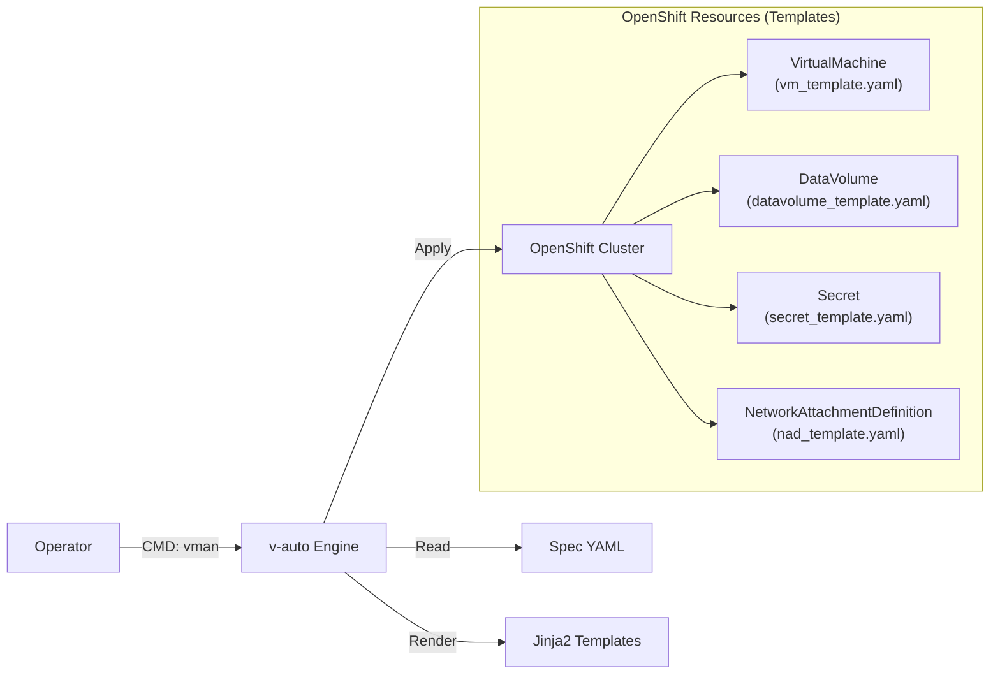

# 📘 v-auto 통합 운영 가이드 (Master Manual)
**Version**: 1.0 (2026.01)
**Target**: Technical Support Team / Operator

---

## 📚 목차 (Table of Contents)
1.  **소개 및 아키텍처 (Introduction)**
    *   툴의 목적 및 구조
    *   작업 디렉토리 안내
2.  **스펙 작성 가이드 (Spec Reference)**
    *   `infrastructure` (네트워크/이미지)
    *   `common` (기본 설정)
    *   `cloud_init` (계정 및 보안)
    *   `instances` (VM 상세 정의)
3.  **운영 절차 (Operation SOP)**
    *   Step 1: 검증 (`inspect`)
    *   Step 2: 배포 (`deploy`)
    *   Step 3: 확인 (`status`)
    *   Step 4: 회수 (`delete`)
4.  **상세 동작 원리 (Deep Dive)**
    *   데이터 매핑 및 템플릿 처리 과정
5.  **문제 해결 (Troubleshooting)**

---

## 1. 소개 및 아키텍처 (Introduction)

### 1.1 툴 개요
`v-auto`는 OpenShift Virtualization 기반의 VM 배포를 **단일 YAML 스펙**으로 자동화하는 도구입니다. 복잡한 K8s 리소스(VirtualMachine, DataVolume, Secret, NAD)를 직접 작성하지 않고, 직관적인 설정 파일 하나로 통합 관리합니다.

### 1.2 시스템 구조


### 1.3 작업 디렉토리 구조 (`/home/core/v-auto`)
*   **`vman`**: 실행 스크립트 (모든 명령의 진입점)
*   **`projects/`**: 프로젝트별 스펙 파일 저장소
    *   `opasnet/web.yaml`: (예시) Opasnet 프로젝트의 Web 서비스 스펙
*   **`templates/`**: 리소스 생성용 Jinja2 템플릿 (수정 금지)
    *   `vm_template.yaml`, `secret_template.yaml` 등

---

## 2. 스펙 작성 가이드 (Spec Reference)

**기준 파일**: `projects/opasnet/web.yaml`
모든 배포는 이 YAML 파일을 작성하는 것에서 시작합니다. 각 섹션별 작성법을 상세히 설명합니다.

### [A] Infrastructure (인프라 정의)
VM이 사용할 네트워크와 OS 이미지를 정의합니다.

**1. 네트워크 및 이미지 정의 (`infrastructure`)**
*   **YAML 입력 (`web.yaml`)**:
    ```yaml
    infrastructure:
      networks:
        pod-net:
          type: pod            # (A) Pod 네트워크 (기본)
        default:
          bridge: br-virt      # (B) 서비스망 (L2 Bridge)
          nad_name: br-virt-net
        storage:
          bridge: br-storage   # (C) 스토리지망
          nad_name: br-storage-net

      images:
        ubuntu-22.04:
          url: "http://.../ubuntu.qcow2" # (D) 이미지 소스
    ```
*   **검증 결과 (`vman inspect` Output)**:
    ```text
    [2] INFRASTRUCTURE CATALOG
          pod-net   [POD]    NAD: -             Bridge: -         <-- (A)
          default   [MULTUS] NAD: br-virt-net   Bridge: br-virt   <-- (B)
          storage   [MULTUS] NAD: br-storage-net Bridge: br-storage <-- (C)
    ```

### [B] Cloud-Init (계정 및 보안)
VM의 OS 계정과 비밀번호를 설정합니다. 리스트 문법을 사용해 **단일 계정부터 다중 계정까지 통합 관리**합니다.

**1. 사용자 설정 (Users Configuration)**
*   **YAML 입력 (`web.yaml`)**:
    ```yaml
    cloud_init: |
      chpasswd:
        list: |
          core:core       # (1) 관리자 계정 암호
          suser:suser     # (2) 추가 서비스 계정 암호
        expire: False
      users:
        - name: core      # (D) Primary User
          sudo: ALL=(ALL) NOPASSWD:ALL
          shell: /bin/bash
        - name: suser     # (E) Secondary User
          sudo: ALL=(ALL) NOPASSWD:ALL
    ```
    > **Note**: 계정이 하나만 필요하면 `list`와 `users` 항목에 하나만 작성하면 됩니다.

*   **검증 결과 (`vman inspect` Output)**:
    ```text
    [4] CLOUD-INIT CONFIGURATION
          Users           :
            - core        <-- (D) 계정
            - suser       <-- (E) 계정
    ```

### [C] Instances (인스턴스 및 네트워크)
개별 VM의 사양과 네트워크 구성을 정의합니다. **리스트(`-`)** 형식이므로 여러 VM을 한 파일에 나열할 수 있습니다.

**1. 통합 설정 예시 (Mixed Spec)**
아래 예시는 **기본형(web-01)**과 **확장형(web-02)**을 한 파일에서 구성하는 방법을 보여줍니다.

*   **YAML 입력 (`web.yaml`)**:
    ```yaml
    instances:
      # [Case 1] 기본형: 단일 네트워크, 기본 사양
      - name: web-01                    # (F)
        cpu: "500m"
        node_selector: {hostname: worker1}
        interfaces:
          - network: default            # (G) nic0
        network_config:
          ethernets:
            enp1s0: {addresses: [10.215.100.101/24]} # (H)

      # [Case 2] 확장형: 다중 네트워크(Multi-NIC), 고사양
      - name: web-02                    # (I)
        cpu: "1000m"
        node_selector: {hostname: worker2}
        interfaces:
          - network: default            # (J) nic0 (서비스망)
          - network: storage            # (K) nic1 (스토리지망)
        network_config:                 # (L) 인터페이스별 IP 지정
          ethernets:
            enp1s0: {addresses: [10.215.100.102/24]}
            enp2s0: {addresses: [192.168.10.50/24]}
    ```

*   **검증 결과 (`vman inspect` Output)**:
    ```text
    [3] INSTANCE & NETWORK CONFIGURATION
      [ INSTANCE: web-01 ]              <-- (F) Case 1
        Interfaces      :
            - Name: nic0 | Network: default <-- (G)
        IP Address      :
            - enp1s0 = 10.215.100.101/24    <-- (H) 단일 IP

      [ INSTANCE: web-02 ]              <-- (I) Case 2
        Interfaces      :
            - Name: nic0 | Network: default <-- (J)
            - Name: nic1 | Network: storage <-- (K) 멀티 네트워크
        IP Address      :
            - enp1s0 = 10.215.100.102/24    <-- (L) 서비스 IP
            - enp2s0 = 192.168.10.50/24     <-- (L) 스토리지 IP
    ```

*   **상태 확인 (`vman status` Output)**:
    ```text
    NAME     STATUS    NODE      IP
    web-01   Running   worker1   10.215.100.101
    web-02   Running   worker2   10.215.100.102
    ```

---

## 3. 운영 절차 (Operation SOP)

모든 명령은 `./vman [프로젝트] [스펙] [액션]` 형식을 따릅니다.

### Step 1: 설정 검증 (Inspect)
작성한 스펙이 정상적으로 해석되는지 확인합니다. **가장 먼저 수행해야 할 단계입니다.**

```bash
./vman opasnet web inspect
```
**[출력 예시]**:
```text
================================================================================
[ v-auto ] VM Specification Inspector
================================================================================
[1] PROJECT INFORMATION
      Project         : opasnet
      Service         : web
      Spec File       : /home/core/v-auto/projects/opasnet/web.yaml

[2] INFRASTRUCTURE CATALOG
      default   [MULTUS] NAD: br-virt-net   Bridge: br-virt
      storage   [MULTUS] NAD: br-storage-net   Bridge: br-storage

[3] INSTANCE & NETWORK CONFIGURATION
  [ INSTANCE: web-01 ]
    Resources       : CPU=500m, Memory=1Gi
    Node Selector   : {'kubernetes.io/hostname': 'worker1'}
    Interfaces      :
        - Name: nic0 | Network: default
    IP Address      :
        - enp1s0 = 10.215.100.101/24
          (Cloud-Init Override)

[4] CLOUD-INIT CONFIGURATION
      Users           :
        - core
        - suser
```
> **Check Point**: 네트워트(`[2]`), IP 주소(`[3]`), 사용자(`[4]`) 정보가 의도한 대로 표시되는지 확인하십시오.

### Step 2: 배포 (Deploy)
검증이 끝난 스펙을 실제 클러스터에 반영합니다.

**1. Dry-Run (모의 배포)**: 실제 반영 전 생성될 YAML을 미리 봅니다.
```bash
./vman opasnet web deploy --dry-run
```
**[출력 예시]**:
```text
[DRY-RUN] Generated Manifest for VirtualMachine: web-01
apiVersion: kubevirt.io/v1
kind: VirtualMachine
metadata:
  name: web-01
  namespace: vm-opasnet
...
(전체 매니페스트 출력)
```

**2. Apply (실제 배포)**:
```bash
./vman opasnet web deploy
```
**[출력 예시]**:
```text
[INFO] Applying configuration for web...
[INFO] Namespace 'vm-opasnet' exists.
[INFO] Secret 'web-01-cloud-init' created/configured.
[INFO] DataVolume 'web-01-root-disk' created/configured.
[INFO] VirtualMachine 'web-01' created/configured.
[SUCCESS] Deployment/Update completed for web.
```

### Step 3: 상태 확인 (Status)
배포 후 VM이 정상 동작하는지 모니터링합니다.

```bash
./vman opasnet web status
```
**[출력 예시]**:
```text
================================================================================
[ v-auto ] VM Service Status : opasnet / web
================================================================================
NAME     NAMESPACE     STATUS    READY   NODE       VMI-IP
web-01   vm-opasnet    Running   True    worker1    10.215.100.101

[ Active Runtime Info ]
  - web-01 : Phase=Running, IP=10.215.100.101, LaunchTime=2026-01-20T11:00:00Z

[ Recent Events ]
  No warning/error events found in namespace vm-opasnet.
```
> **Check Point**: `STATUS`가 `Running`이고 `VMI-IP`가 정상적으로 할당되었는지 확인하십시오.

### Step 4: 회수 (Delete)
작업이 종료되거나 잘못 배포된 경우 리소스를 일괄 삭제합니다.

```bash
./vman opasnet web delete
```
**[출력 예시]**:
```text
[WARN] You are about to DELETE the following resources for service 'web':
  - VirtualMachine: web-01
  - DataVolume: web-01-root-disk
  - Secret: web-01-cloud-init
  - Service: (If any)

Are you sure check? (y/n): y  <-- 사용자 확인 (실수 방지)

[INFO] Deleting VirtualMachine web-01...
[INFO] Deleting DataVolume web-01-root-disk...
[INFO] Deleting Secret web-01-cloud-init...
[SUCCESS] All resources for 'web' have been deleted. <-- 전체 리소스 삭제 완료
```

## 4. 상세 동작 원리 (Deep Dive)

**"내가 쓴 YAML이 어떻게 K8s 리소스가 되나요?"**

### 4.1 핵심 로직 (Core Logic)
1.  **Inheritance (상속)**: `instances`의 설정은 `common` 설정을 덮어씁니다. (예: `web-01`이 `cpu`를 지정하면 `common.cpu`는 무시됨)
2.  **Jinja2 Templating**: 파이썬 엔진이 YAML 값을 읽어 템플릿의 `{{ variable }}` 위치에 문자열을 치환해 넣습니다.
3.  **Idempotency (멱등성)**: `apply` 명령을 사용하므로, 스펙이 변하지 않았다면 여러 번 실행해도 결과는 같습니다.

### 4.2 템플릿-변수 매핑 상세 (Template Mapping Analysis)
`templates/` 디렉토리 내의 파일들은 K8s 리소스의 뼈대입니다. 각 파일의 **전체 내용**과 **변수 매핑 로직**을 상세히 분석합니다.

**1. vm_template.yaml (VirtualMachine)**
VM의 사양, 디스크 마운트, 네트워크 연결을 정의하는 핵심 템플릿입니다.
```yaml
apiVersion: kubevirt.io/v1
kind: VirtualMachine
metadata:
  name: {{ vm_name }}                # <--- instances[].name (예: web-01)
  namespace: {{ namespace }}         # <--- vm-[project] (예: vm-opasnet)
spec:
  running: true                      # <--- 배포 시 즉시 시작
  template:
    metadata:
      labels:
        kubevirt.io/vm: {{ vm_name }}
    spec:
      domain:
        devices:
          disks:                     # [디스크 연결 정의]
            - disk:
                bus: virtio
              name: root-disk        # 부팅 디스크
            - disk:
                bus: virtio
              name: cloudinitdisk    # 초기화 ISO
          interfaces:                # [네트워크 인터페이스 정의]
          
          - name: {{ iface.name }}   # <--- (자동생성) nic0, nic1...
            
            masquerade: {}           # <--- Pod Network 모드
            
            bridge: {}               # <--- Multus Bridge 모드 (대부분 여기 사용)
             
          
        resources:
          requests:
            cpu: {{ cpu }}           # <--- instances[].cpu (or common.cpu)
            memory: {{ memory }}     # <--- instances[].memory (or common.memory)
      networks:                      # [네트워크 연결 대상]
      
      - name: {{ iface.name }} 
        
        pod: {}
        
        multus:
          networkName: {{ iface.nad_ref }} # <--- infrastructure.networks[].nad_name
        
      
      volumes:
        - name: root-disk
          dataVolume:
            name: {{ vm_name }}-root-disk   # <--- 연결될 DataVolume 이름
        - name: cloudinitdisk
          cloudInitNoCloud:
            secretRef:
              name: {{ vm_name }}-cloud-init # <--- 연결될 Secret 이름
```

**2. secret_template.yaml (Cloud-Init)**
계정 설정(`userData`)과 네트워크 설정(`networkData`)을 담고 있는 보안 리소스입니다.
```yaml
apiVersion: v1
kind: Secret
metadata:
  name: {{ vm_name }}-cloud-init
  namespace: {{ namespace }}
type: Opaque
stringData:
  userData: |
    
    {{ cloud_init_content | indent(4) }} # <--- web.yaml: cloud_init 전체 내용
    
  
  networkData: |
    {{ network_config | to_yaml | indent(4) }} # <--- instances[].network_config (고정 IP 설정 등)
  
```

**3. datavolume_template.yaml (DataVolume)**
VM 부팅에 필요한 OS 이미지를 다운로드하고 PVC(볼륨)를 생성합니다.
```yaml
apiVersion: cdi.kubevirt.io/v1beta1
kind: DataVolume
metadata:
  name: {{ vm_name }}-root-disk      # <--- VM에 연결될 디스크 이름
  namespace: {{ namespace }}
spec:
  source:
    http:
      url: {{ image_url }}           # <--- infrastructure.images[].url (이미지 소스)
  pvc:
    accessModes:
      - {{ access_mode }}            # <--- 기본값: ReadWriteOnce
    storageClassName: {{ storage_class }} # <--- common.storage_class (스토리지 클래스)
    resources:
      requests:
        storage: {{ disk_size }}     # <--- common.disk_size (디스크 크기)
```

**4. nad_template.yaml (NetworkAttachmentDefinition)**
물리 네트워크와 K8s를 연결하는 Multus 리소스입니다. (네트워크당 1개 생성)
```yaml
apiVersion: "k8s.cni.cncf.io/v1"
kind: NetworkAttachmentDefinition
metadata:
  name: {{ nad_name }}               # <--- infrastructure.networks[].nad_name
  namespace: {{ namespace }}
spec:
  config: '{
      "cniVersion": "0.3.1",
      "name": "{{ nad_name }}",
      "type": "bridge",              # <--- Linux Bridge CNI 사용
      "bridge": "{{ bridge }}"       # <--- infrastructure.networks[].bridge (물리 브리지명)
      
      , "ipam": {{ ipam }}           # <--- IP 관리 설정 (옵션)
      
    }'
```

---

## 5. 문제 해결 (Troubleshooting)
**Q: `vman inspect`에서 IP가 `Auto/DHCP`로 나옵니다.**
A: `web.yaml`의 `network_config` 들여쓰기나 문법을 확인하세요. `ethernets` 키 바로 아래에 인터페이스명(`enp1s0`)이 와야 합니다.

**Q: `deploy` 중 권한 오류(Forbidden)가 발생합니다.**
A: `oc login -u admin`으로 로그인되어 있는지 확인하세요. (`oc whoami` 로 확인 가능)

**Q: VM은 Running인데 접속이 안 됩니다.**
A: `vman status`로 IP가 정상 할당되었는지 확인하고, `cloud-init` 로그를 확인해야 합니다. (콘솔 접속 필요)
