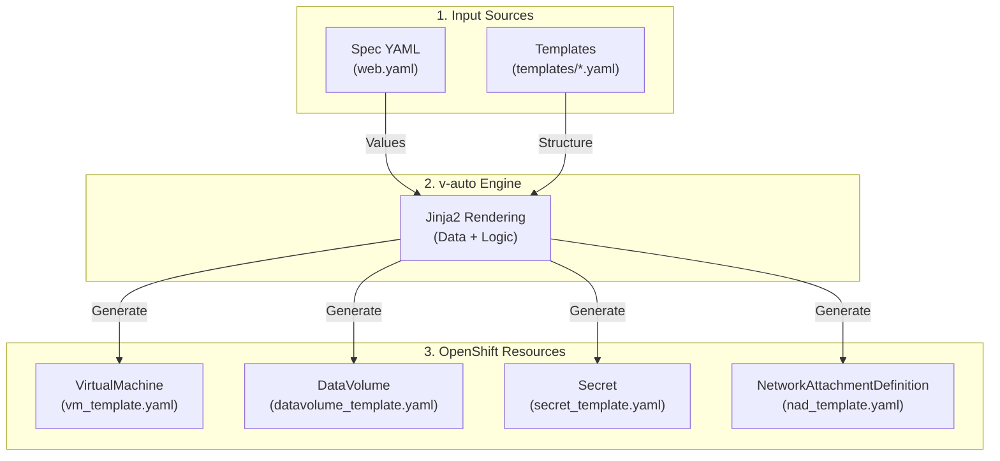

# 📘 v-auto 통합 운영 가이드 (Master Manual)
**Version**: 1.0 (2026.01)
**Target**: Technical Support Team / Operator

---

## 📚 목차 (Table of Contents)
1.  **소개 및 아키텍처 (Introduction)**
    *   툴의 목적 및 구조
    *   작업 디렉토리 안내
2.  **스펙 작성 가이드 (Spec Reference)**
    *   `infrastructure` (네트워크/이미지)
    *   `common` (기본 설정)
    *   `cloud_init` (계정 및 보안)
    *   `instances` (VM 상세 정의)
3.  **운영 절차 (Operation SOP)**
    *   Step 1: 검증 (`inspect`)
    *   Step 2: 배포 (`deploy`)
    *   Step 3: 확인 (`status`)
    *   Step 4: 회수 (`delete`)
4.  **상세 동작 원리 (Deep Dive)**
    *   데이터 매핑 및 템플릿 처리 과정
5.  **문제 해결 (Troubleshooting)**

---

## 1. 소개 및 아키텍처 (Introduction)

### 1.1 툴 개요
`v-auto`는 OpenShift Virtualization 기반의 VM 배포를 **단일 YAML 스펙**으로 자동화하는 도구입니다. 복잡한 K8s 리소스(VirtualMachine, DataVolume, Secret, NAD)를 직접 작성하지 않고, 직관적인 설정 파일 하나로 통합 관리합니다.

### 1.2 시스템 구조



### 1.3 작업 디렉토리 구조 (`/home/core/v-auto`)
```text
/home/core/v-auto/
├── projects/                  # [프로젝트 저장소]
│   └── opasnet/
│       └── web.yaml           # (메인 스펙 파일)
├── templates/                 # [리소스 템플릿]
│   ├── vm_template.yaml
│   ├── datavolume_template.yaml
│   ├── secret_template.yaml
│   └── nad_template.yaml
├── vman                       # [실행 스크립트]
├── vm_manager.py              # (파이썬 엔진)
└── DOCS_USER.md               # (본 가이드)
```

---

## 2. 스펙 작성 가이드 (Spec Reference)

**기준 파일**: `projects/opasnet/web.yaml`
모든 배포는 이 YAML 파일을 작성하는 것에서 시작합니다. 각 섹션별 작성법을 상세히 설명합니다.

### [A] Infrastructure (인프라 정의)
VM이 사용할 네트워크와 OS 이미지를 정의합니다.

**1. 네트워크 및 이미지 정의 (`infrastructure`)**
*   **YAML 입력 (`web.yaml`)**:
    ```yaml
    infrastructure:
      networks:
        pod-net:
          type: pod            # (A) Pod 네트워크 (기본)
        default:
          bridge: br-virt      # (B) 서비스망 (L2 Bridge)
          nad_name: br-virt-net
        storage:
          bridge: br-storage   # (C) 스토리지망
          nad_name: br-storage-net

      images:
        ubuntu-22.04:
          url: "http://.../ubuntu.qcow2" # (D) 이미지 소스
    ```
*   **검증 결과 (`vman inspect` Output)**:
    ```text
    [2] INFRASTRUCTURE CATALOG
          pod-net   [POD]    NAD: -             Bridge: -         <-- (A)
          default   [MULTUS] NAD: br-virt-net   Bridge: br-virt   <-- (B)
          storage   [MULTUS] NAD: br-storage-net Bridge: br-storage <-- (C)
    ```

### [B] Cloud-Init (계정 및 보안)
VM의 OS 계정과 비밀번호를 설정합니다. 리스트 문법을 사용해 **단일 계정부터 다중 계정까지 통합 관리**합니다.

**1. 사용자 설정 (Users Configuration)**
*   **YAML 입력 (`web.yaml`)**:
    ```yaml
    cloud_init: |
      chpasswd:
        list: |
          core:core       # (1) 관리자 계정 암호
          suser:suser     # (2) 추가 서비스 계정 암호
        expire: False
      users:
        - name: core      # (D) Primary User
          sudo: ALL=(ALL) NOPASSWD:ALL
          shell: /bin/bash
        - name: suser     # (E) Secondary User
          sudo: ALL=(ALL) NOPASSWD:ALL
    ```
    > **Note**: 계정이 하나만 필요하면 `list`와 `users` 항목에 하나만 작성하면 됩니다.

*   **검증 결과 (`vman inspect` Output)**:
    ```text
    [4] CLOUD-INIT CONFIGURATION
          Users           :
            - core        <-- (D) 계정
            - suser       <-- (E) 계정
    ```

### [C] Instances (인스턴스 및 네트워크)
개별 VM의 사양과 네트워크 구성을 정의합니다. **리스트(`-`)** 형식이므로 여러 VM을 한 파일에 나열할 수 있습니다.

**1. 통합 설정 예시 (Mixed Spec)**
아래 예시는 **기본형(web-01)**과 **확장형(web-02)**을 한 파일에서 구성하는 방법을 보여줍니다.

*   **YAML 입력 (`web.yaml`)**:
    ```yaml
    instances:
      # [Case 1] 기본형: 단일 네트워크, 기본 사양
      - name: web-01                    # (F)
        cpu: "500m"
        node_selector: {hostname: worker1}
        interfaces:
          - network: default            # (G) nic0
        network_config:
          ethernets:
            enp1s0: {addresses: [10.215.100.101/24]} # (H)

      # [Case 2] 확장형: 다중 네트워크(Multi-NIC), 고사양
      - name: web-02                    # (I)
        cpu: "1000m"
        node_selector: {hostname: worker2}
        interfaces:
          - network: default            # (J) nic0 (서비스망)
          - network: storage            # (K) nic1 (스토리지망)
        network_config:                 # (L) 인터페이스별 IP 지정
          ethernets:
            enp1s0: {addresses: [10.215.100.102/24]}
            enp2s0: {addresses: [192.168.10.50/24]}
    ```

*   **검증 결과 (`vman inspect` Output)**:
    ```text
    [3] INSTANCE & NETWORK CONFIGURATION
      [ INSTANCE: web-01 ]              <-- (F) Case 1
        Interfaces      :
            - Name: nic0 | Network: default <-- (G)
        IP Address      :
            - enp1s0 = 10.215.100.101/24    <-- (H) 단일 IP

      [ INSTANCE: web-02 ]              <-- (I) Case 2
        Interfaces      :
            - Name: nic0 | Network: default <-- (J)
            - Name: nic1 | Network: storage <-- (K) 멀티 네트워크
        IP Address      :
            - enp1s0 = 10.215.100.102/24    <-- (L) 서비스 IP
            - enp2s0 = 192.168.10.50/24     <-- (L) 스토리지 IP
    ```

*   **상태 확인 (`vman status` Output)**:
    ```text
    NAME     STATUS    NODE      IP
    web-01   Running   worker1   10.215.100.101
    web-02   Running   worker2   10.215.100.102
    ```

---

## 3. 운영 절차 (Operation SOP)

모든 명령은 `./vman [프로젝트] [스펙] [액션]` 형식을 따릅니다.

### Step 1: 설정 검증 (Inspect)
작성한 스펙이 정상적으로 해석되는지 확인합니다. **가장 먼저 수행해야 할 단계입니다.**

```bash
./vman opasnet web inspect
```
**[출력 예시]**:
```text
================================================================================
[ v-auto ] VM Specification Inspector
================================================================================
[1] PROJECT INFORMATION
      Project         : opasnet
      Service         : web
      Spec File       : /home/core/v-auto/projects/opasnet/web.yaml

[2] INFRASTRUCTURE CATALOG
      default   [MULTUS] NAD: br-virt-net   Bridge: br-virt   <--- [Infra] 서비스 네트워크 확인
      storage   [MULTUS] NAD: br-storage-net Bridge: br-storage <--- [Infra] 스토리지 네트워크 확인

[3] INSTANCE & NETWORK CONFIGURATION
  [ INSTANCE: web-01 ]
    Resources       : CPU=500m, Memory=1Gi
    Node Selector   : {'kubernetes.io/hostname': 'worker1'}
    Interfaces      :
        - Name: nic0 | Network: default         <--- [Net] 기본 네트워크 연결
    IP Address      :
        - enp1s0 = 10.215.100.101/24            <--- [IP] 고정 IP (Cloud-Init)

  [ INSTANCE: web-02 ]                          <--- [Spec] 두 번째 인스턴스 확인
    Resources       : CPU=1, Memory=1Gi
    Node Selector   : {'kubernetes.io/hostname': 'worker2'}
    Interfaces      :
        - Name: nic0 | Network: default
        - Name: nic1 | Network: storage         <--- [Net] 추가 네트워크(스토리지) 연결
    IP Address      :
        - enp1s0 = 10.215.100.102/24            <--- [IP] 서비스망 IP
        - enp2s0 = 192.168.10.50/24             <--- [IP] 스토리지망 IP

[4] CLOUD-INIT CONFIGURATION
      Users           :
        - core        <--- [Auth] 생성될 관리자 계정
        - suser       <--- [Auth] 생성될 서비스 계정
```
> **Check Point**: 네트워트(`[2]`), IP 주소(`[3]`), 사용자(`[4]`) 정보가 의도한 대로 표시되는지 확인하십시오.

### Step 2: 배포 (Deploy)
검증이 끝난 스펙을 실제 클러스터에 반영합니다.

**1. Dry-Run (모의 배포)**: 실제 반영 전 생성될 YAML을 미리 봅니다.
```bash
./vman opasnet web deploy --dry-run
```
**[출력 예시]**:
```text
[DRY-RUN] Generated Manifest for VirtualMachine: web-01
apiVersion: kubevirt.io/v1
kind: VirtualMachine             <--- [DryRun] 생성될 리소스 타입 확인
metadata:
  name: web-01                   <--- [DryRun] 리소스 이름
  namespace: vm-opasnet          <--- [DryRun] 타겟 네임스페이스
...
(전체 매니페스트 출력)
```

**2. Apply (실제 배포)**:
```bash
./vman opasnet web deploy
```
**[출력 예시]**:
```text
[INFO] Applying configuration for web...
[INFO] Namespace 'vm-opasnet' exists.
[INFO] Secret 'web-01-cloud-init' created/configured.
[INFO] DataVolume 'web-01-root-disk' created/configured.
[INFO] VirtualMachine 'web-01' created/configured.    <--- [Flow] web-01 생성 완료

[INFO] Secret 'web-02-cloud-init' created/configured.
[INFO] DataVolume 'web-02-root-disk' created/configured.
[INFO] VirtualMachine 'web-02' created/configured.    <--- [Flow] web-02 생성 완료

[SUCCESS] Deployment/Update completed for web.        <--- [Result] 전체 배포 완료
```

### Step 3: 상태 확인 (Status)
배포 후 VM이 정상 동작하는지 모니터링합니다.

```bash
./vman opasnet web status
```
**[출력 예시]**:
```text
================================================================================
[ v-auto ] VM Service Status : opasnet / web
================================================================================
NAME     NAMESPACE     STATUS    READY   NODE       VMI-IP
web-01   vm-opasnet    Running   True    worker1    10.215.100.101  <--- [Status] 실행 중인 노드 및 IP

[ Active Runtime Info ]
  - web-01 : Phase=Running, IP=10.215.100.101, LaunchTime=...       <--- [Detail] 상세 런타임 정보

[ Recent Events ]
  No warning/error events found in namespace vm-opasnet.            <--- [Event] 최근 에러/경고 로그
```
> **Check Point**: `STATUS`가 `Running`이고 `VMI-IP`가 정상적으로 할당되었는지 확인하십시오.

### Step 4: 회수 (Delete)
작업이 종료되거나 잘못 배포된 경우 리소스를 일괄 삭제합니다.

```bash
./vman opasnet web delete
```
**[출력 예시]**:
```text
[WARN] You are about to DELETE the following resources for service 'web':
  - VirtualMachine: web-01
  - DataVolume: web-01-root-disk
  - Secret: web-01-cloud-init
  - VirtualMachine: web-02
  - DataVolume: web-02-root-disk
  - Secret: web-02-cloud-init
  - Service: (If any)

Are you sure check? (y/n): y  <--- [Interact] 사용자 확인

[INFO] Deleting VirtualMachine web-01...
[INFO] Deleting DataVolume web-01-root-disk...
[INFO] Deleting Secret web-01-cloud-init...
[INFO] Deleting VirtualMachine web-02...              <--- [Flow] web-02 삭제 진행
[INFO] Deleting DataVolume web-02-root-disk...
[INFO] Deleting Secret web-02-cloud-init...
[SUCCESS] All resources for 'web' have been deleted. <--- [Result] 전체 리소스 회수 완료
```

## 4. 상세 동작 원리 (Deep Dive)

**"내가 쓴 YAML이 어떻게 K8s 리소스가 되나요?"**

### 4.1 핵심 로직 (Core Logic)
1.  **Inheritance (상속)**: `instances`의 설정은 `common` 설정을 덮어씁니다. (예: `web-01`이 `cpu`를 지정하면 `common.cpu`는 무시됨)
2.  **Jinja2 Templating**: 파이썬 엔진이 YAML 값을 읽어 템플릿의 `{{ variable }}` 위치에 문자열을 치환해 넣습니다.
3.  **Idempotency (멱등성)**: `apply` 명령을 사용하므로, 스펙이 변하지 않았다면 여러 번 실행해도 결과는 같습니다.

### 4.2 템플릿-변수 매핑 상세 (Template Mapping Analysis)
`templates/` 디렉토리 내의 파일들은 K8s 리소스의 뼈대입니다. 각 파일의 **전체 내용**과 **변수 매핑 로직**을 상세히 분석합니다.

**1. vm_template.yaml (VirtualMachine)**
VM의 사양, 디스크 마운트, 네트워크 연결을 정의하는 핵심 템플릿입니다.
```yaml
apiVersion: kubevirt.io/v1
kind: VirtualMachine
metadata:
  name: {{ vm_name }}                # <--- [web.yaml] instances > name (VM 이름)
  namespace: {{ namespace }}         # <--- [CLI] vm-[project] (자동생성)
spec:
  running: true
  template:
    metadata:
      labels:
        kubevirt.io/vm: {{ vm_name }}
    spec:
      domain:
        devices:
          disks:
            - disk:
                bus: virtio
              name: root-disk
            - disk:
                bus: virtio
              name: cloudinitdisk
          interfaces:
          
          - name: {{ iface.name }}   # <--- [Auto] nic0, nic1... (자동 순차부여)
            
            masquerade: {}           # <--- Pod Network 모드
            
            bridge: {}               # <--- Multus Bridge 모드 (대부분 여기 사용)
             
          
        resources:
          requests:
            cpu: {{ cpu }}           # <--- [web.yaml] instances > cpu (또는 common.cpu)
            memory: {{ memory }}     # <--- [web.yaml] instances > memory (또는 common.memory)
      networks:
      
      - name: {{ iface.name }} 
        
        pod: {}
        
        multus:
          networkName: {{ iface.nad_ref }} # <--- [web.yaml] infrastructure > networks > nad_name
        
      
      volumes:
        - name: root-disk
          dataVolume:
            name: {{ vm_name }}-root-disk
        - name: cloudinitdisk
          cloudInitNoCloud:
            secretRef:
              name: {{ vm_name }}-cloud-init
```

**2. secret_template.yaml (Cloud-Init)**
계정 설정(`userData`)과 네트워크 설정(`networkData`)을 담고 있는 보안 리소스입니다.
```yaml
apiVersion: v1
kind: Secret
metadata:
  name: {{ vm_name }}-cloud-init
  namespace: {{ namespace }}
type: Opaque
stringData:
  userData: |
    
    {{ cloud_init_content | indent(4) }} # <--- [web.yaml] cloud_init (전체 내용 삽입)
    
  
  networkData: |
    {{ network_config | to_yaml | indent(4) }} # <--- [web.yaml] instances > network_config (Netplan)
  
```

**3. datavolume_template.yaml (DataVolume)**
VM 부팅에 필요한 OS 이미지를 다운로드하고 PVC(볼륨)를 생성합니다.
```yaml
apiVersion: cdi.kubevirt.io/v1beta1
kind: DataVolume
metadata:
  name: {{ vm_name }}-root-disk
  namespace: {{ namespace }}
spec:
  source:
    http:
      url: {{ image_url }}           # <--- [web.yaml] infrastructure > images > url
  pvc:
    accessModes:
      - {{ access_mode }}            # <--- [System] ReadWriteOnce (기본값)
    storageClassName: {{ storage_class }} # <--- [web.yaml] common > storage_class
    resources:
      requests:
        storage: {{ disk_size }}     # <--- [web.yaml] common > disk_size
```

**4. nad_template.yaml (NetworkAttachmentDefinition)**
물리 네트워크와 K8s를 연결하는 Multus 리소스입니다. (네트워크당 1개 생성)
```yaml
apiVersion: "k8s.cni.cncf.io/v1"
kind: NetworkAttachmentDefinition
metadata:
  name: {{ nad_name }}               # <--- [web.yaml] infrastructure > networks > nad_name
  namespace: {{ namespace }}
spec:
  config: '{
      "cniVersion": "0.3.1",
      "name": "{{ nad_name }}",
      "type": "bridge",
      "bridge": "{{ bridge }}"       # <--- [web.yaml] infrastructure > networks > bridge
      
      , "ipam": {{ ipam }}
      
    }'
```

---

## 5. 문제 해결 (Troubleshooting)
**Q: `vman inspect`에서 IP가 `Auto/DHCP`로 나옵니다.**
A: `web.yaml`의 `network_config` 들여쓰기나 문법을 확인하세요. `ethernets` 키 바로 아래에 인터페이스명(`enp1s0`)이 와야 합니다.

**Q: `deploy` 중 권한 오류(Forbidden)가 발생합니다.**
A: `oc login -u admin`으로 로그인되어 있는지 확인하세요. (`oc whoami` 로 확인 가능)

**Q: VM은 Running인데 접속이 안 됩니다.**
A: `vman status`로 IP가 정상 할당되었는지 확인하고, `cloud-init` 로그를 확인해야 합니다. (콘솔 접속 필요)
