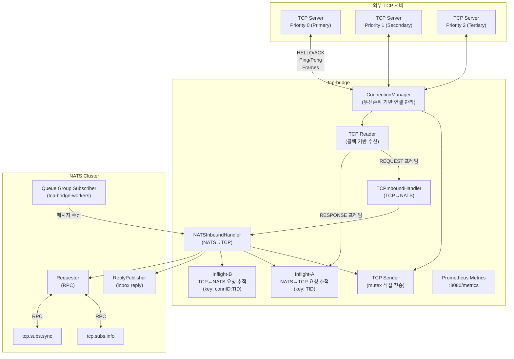
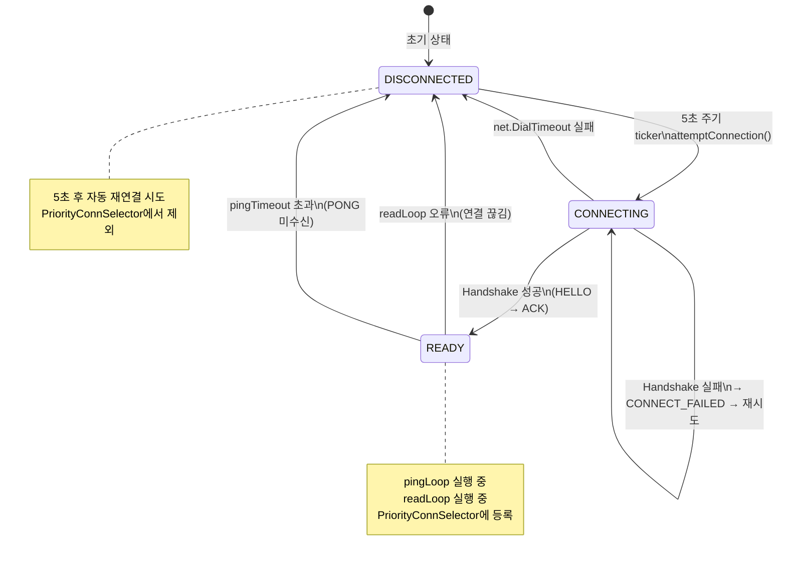
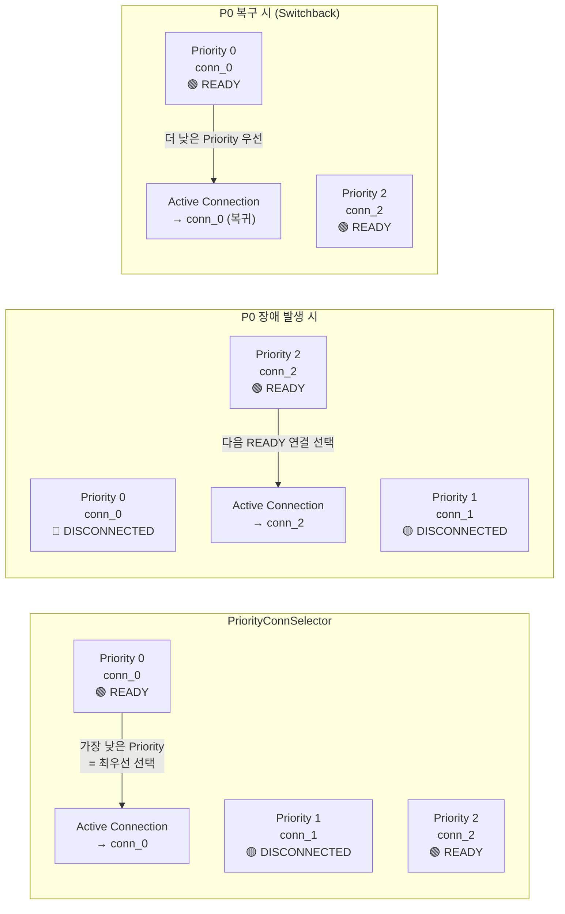
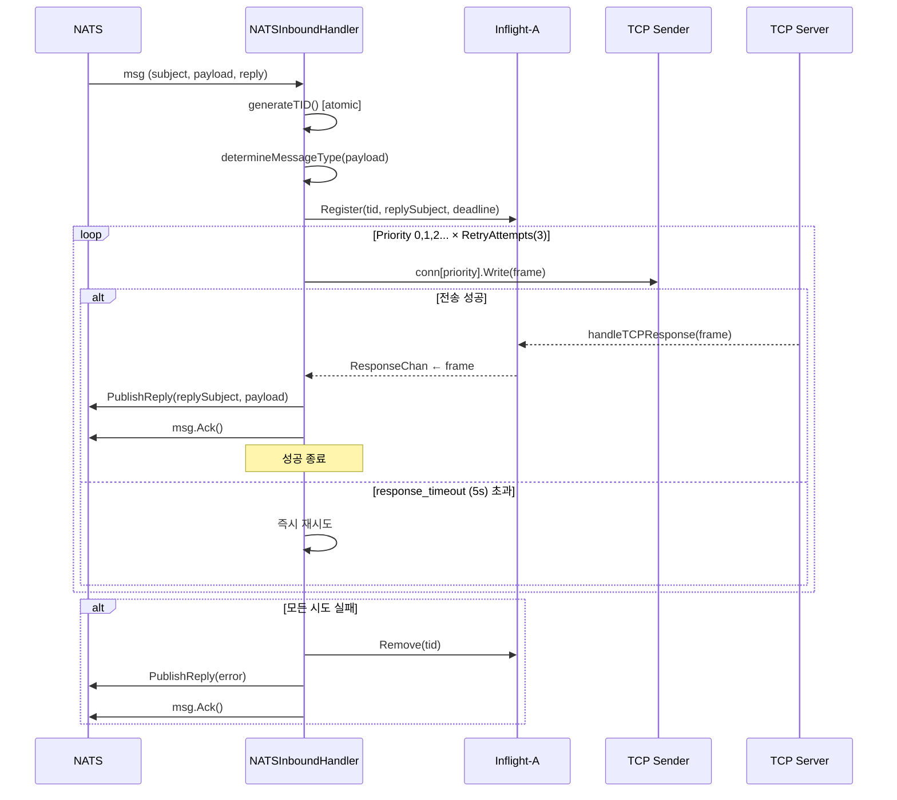
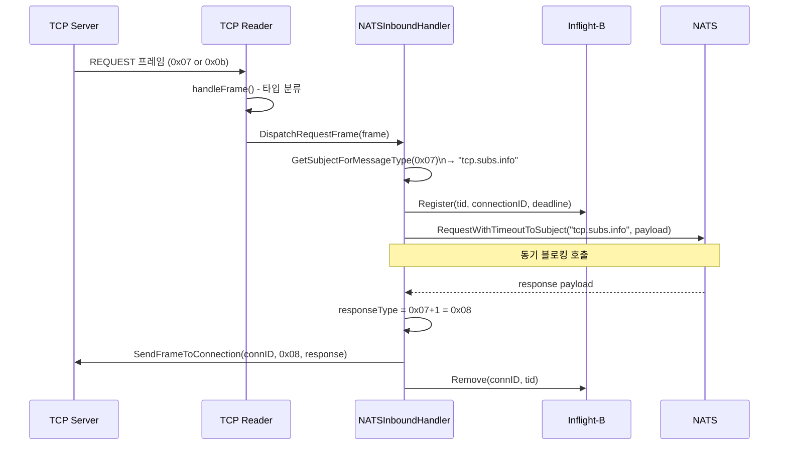
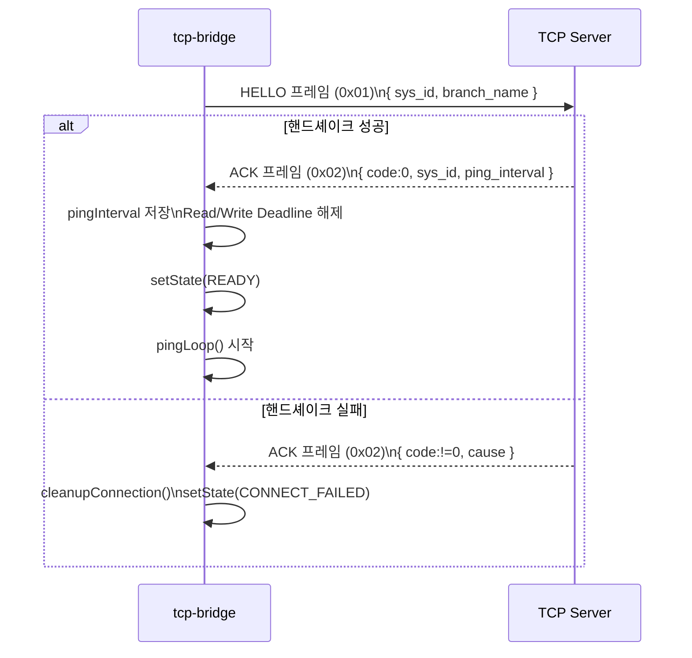
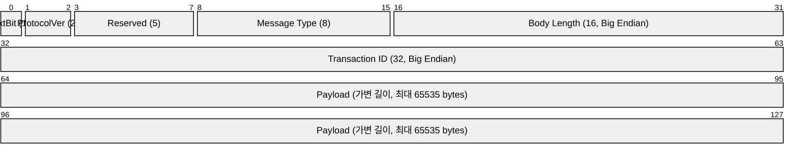
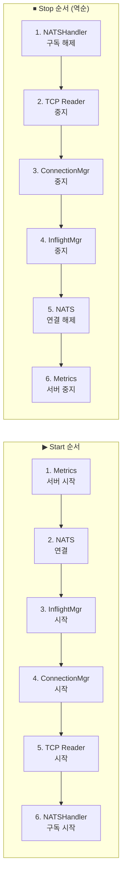
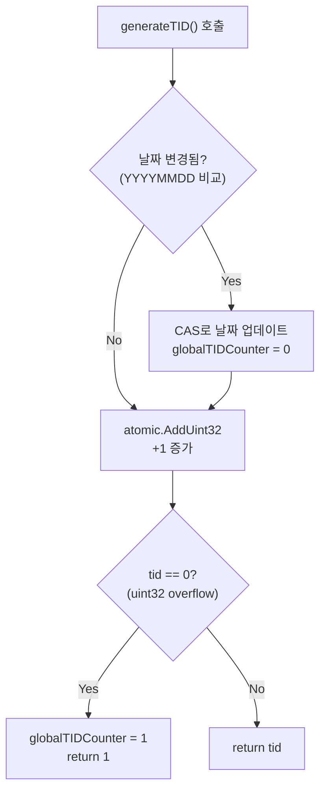

# TCP Bridge 로직 다이어그램

---

## 1. 전체 시스템 아키텍처



---

## 2. 연결 상태 머신 (ConnectionManager)



---

## 3. 우선순위 기반 Failover



---

## 4. NATS → TCP 메시지 흐름



---

## 5. TCP → NATS 메시지 흐름



---

## 6. 핸드셰이크 프로토콜



---

## 7. Ping-Pong Keep-Alive

```mermaid
sequenceDiagram
    participant Loop as pingLoop (1초 체크)
    participant Bridge as tcp-bridge
    participant Server as TCP Server

    loop 매 1초마다
        Loop->>Loop: idleTime = now - lastActivityTime

        alt idleTime >= pingInterval AND !awaitingPong
            Loop->>Bridge: sendPing()
            Bridge->>Server: PING 프레임 (0x03)
            Loop->>Loop: awaitingPong = true
        end

        alt awaitingPong AND idleTime > pingTimeout
            Loop->>Bridge: cleanupConnection()
            Bridge->>Bridge: setState(DISCONNECTED)
            Note over Bridge: 재연결 트리거
        end
    end

    Server-->>Bridge: PONG 프레임 (0x04)
    Bridge->>Loop: awaitingPong = false
```

---

## 8. 프레임 포맷



---

## 9. 애플리케이션 시작/종료 순서



---

## 10. TID 생성 로직


